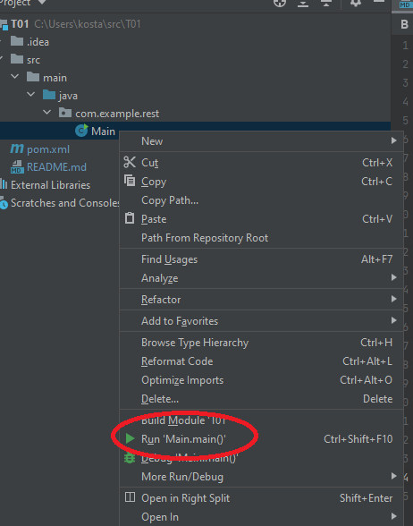

# T01 - SOEN 487

This is the template provided to start the web server for Tutorial 1. 
You should download this to follow along when watching the tutorial.

The finished example can be found on the finished branch of this repository.

We encourage you to use either IntelliJ IDE **or** maven from command line in order to get the best support from our TAs.

## IntelliJ Instructions ##

* Browse to src->main->java->com.example.rest
* Right click to Main and choose Run Main.main()

## Maven Instructions ##

    Compile:
        mvn install

    Run (Grizzly HTTP server)
        mvn exec:java

    Clean:
        mvn clean
