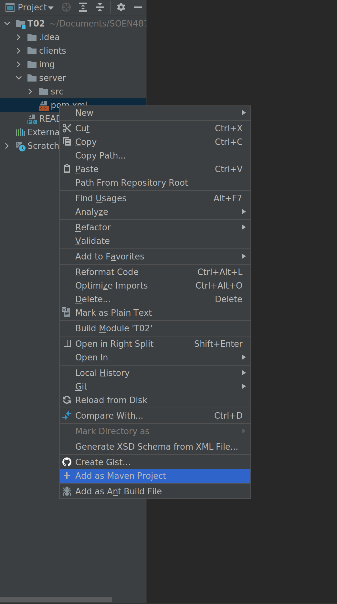

# T02 - SOEN 487

This is the template provided to start the web server for Tutorial 2.
You should download this to follow along when watching the tutorial.

The finished example can be found on the finished branch of this repository.

We encourage you to use either IntelliJ IDE **or** maven from command line in order to get the best support from our TAs.

## Included Projects ##

1. The server/REST API
    * Located in /server
    * Is used to hold the REST API built in the previous tutorial
    
2. The example client
    * Located in /clients/example
    * Is used to hold the related classes for building the client side for our tutorial
    
3. The GitHub client
    * Located in /clients/github
    * Is used to hold the related classes for building the client that will interact with GitHub
    which is also used for our tutorial

## IntelliJ Instructions ##

* For each included project, navigate to the directory and find the pom.xml file, right
click and click on "Add as Maven Project" to load up the project and start working on it.

  

* Browse to desired class to run the main method
* Right click associated class and choose Run main()

## Maven Instructions ##

    Run the following commands in the associated project directory:

    Compile:
        mvn install

    Run
        mvn exec:java

    Run (Customer Client)
        mvn exec:java -f customer-client-pom.xml

    Run (GitHub Client)
        mvn exec:java -f github-client-pom.fml

    Clean:
        mvn clean
